# 计算机是怎么跑起来的
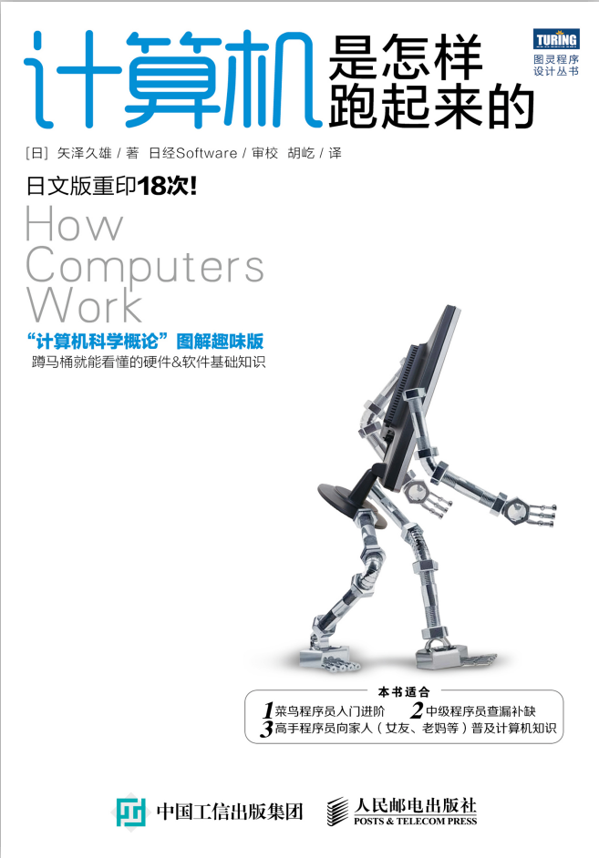

## 第1章　计算机的三大原则
### 1.什么是编码？
通常将为了便于计算机处理而经过数字化处理的信息称作编码。计算机内部会把所有的信息都当成数字来处理，尽管有些信息本来不是数字。用于表示字符的数字是“字符编码”，用于表示颜色的数字是“颜色编码”。

### 2.　计算机的三个根本性基础
1. 计算机是执行输入、运算、输出的机器

2. 程序是指令和数据的集合

3. 计算机的处理方式有时与人们的思维习惯不同

## 第2章　试着制造一台计算机吧
### 1.制作微型计算机所需的基础元件
只有 3个，CPU、内存和 I/O

### 2.如何数 IC 的引脚序号
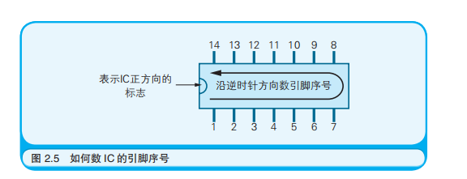

### 3.连接
请先将 +5V 电源连接到各个 IC 的 Vcc 引脚上，然后将 0V 电源连接到各个 IC 的 GND 引脚上。接下来还需要将 +5V 和 0V 连接到**时钟发生器**上。接通电源后这些 IC 和时钟发生器就可以工作了。

数字 IC 中，每个引脚上的电压要么是 0V、要么是 +5V，通过这两个电压与其他的 IC 进行电信号的收发。

### 4.引脚代号
以Z80 CPU 为例，它的数据总线引脚共有 8 个，用代号 D0～D7表示。

其中的 **D** 表示 **Data（数据）**，后面的数字 0～7 与地址总线引脚代号的规则相同，也表示二进制数中各个数字的位置。

以内存 TC5517 为例，上也有地址总线引脚（A0～A10）,其中的 **A** 表示 **Address（地址）**

### 5.寄存器
寄存器是位于 CPU 和 **I/O** 中的数据存储器。

不光 CPU 存在寄存器， I/O 也具备寄存器。

### 6.连接用于区分读写对象是内存还是 I/O 的引脚
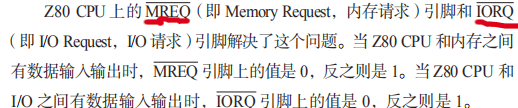

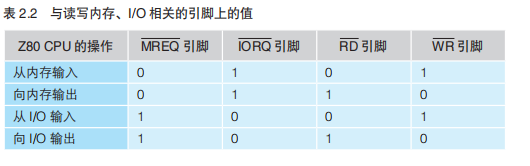

## 第3章　体验一次手工汇编
### 1.什么是机器语言？
由二进制数字构成的程序，CPU 可以直接对其解释、执行。

### 2.CPU 中的标志寄存器（Flags Register）有什么作用？
用于在运算指令执行后，存储运算结果的某些状态。

### 3.编写程序之前需要了解的硬件信息
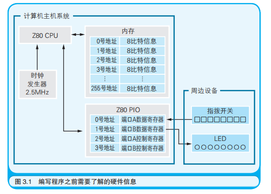

### 4.Z80 CPU 中的主要指令
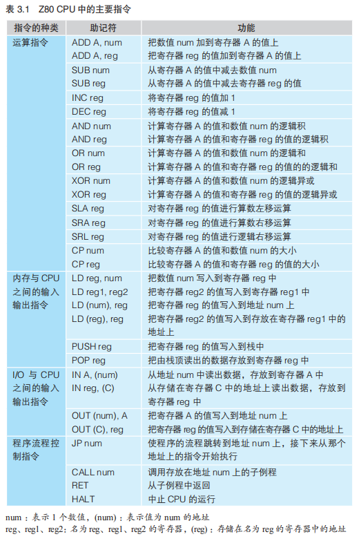

## 第4章　程序像河水一样流动着
### 1.自然界中河流的三种流动方式。
向着一个方向流淌；流着流着产生支流；卷成漩涡。

在程序中，把犹如水流向着一个方向流淌的流程称作 **“顺序执行”**；把犹如水流流着流着产生了支流的流程称作 **“条件分支”**；把犹如水流卷成漩涡的流程称作 **“循环”**。

程序员一般都是先考虑程序的流程再开始编写程序的。只有编写过程序的人才能体会到“程序是流动着的”。所以提出—— **流程（Flow）的图（Chart）**

### 2.事件驱动是什么？
用户的操作等产生事件后，由事件决定程序的流程。

### 3.流程图符号
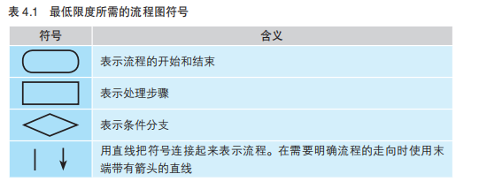
 
不常用流程图符号
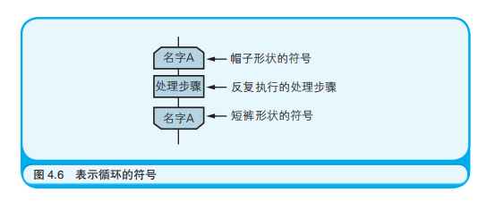

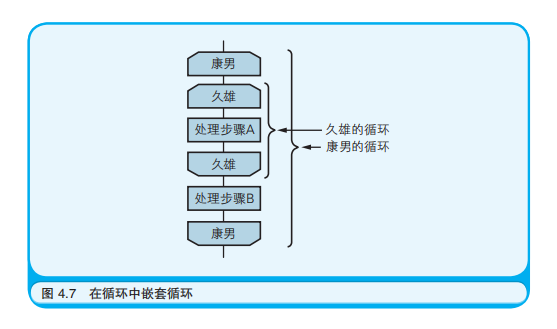

### 4.画流程图来思考算法


### 5.关于中断引脚
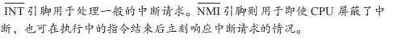

### 6.关于事件驱动
程序员们经常用事件驱动的方式编写那些工作在 GUI（Graphical User Inteface，图形用户界面）环境中的应用程序，例如 Windows 操作系统中的应用程序。这听起来好像挺复杂的，但其实如果把事件驱动想象成是 **两个程序在对话**，理解起来就简单了。

### 7.状态转化表
对于那些觉得画图很麻烦的人，笔者推荐使用“状态转化表”
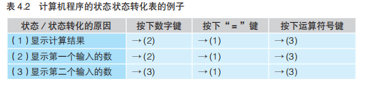

### 8.电阻的外观以及电阻值的计算方法
无论是哪个行业，都有那么一些数字、结论是从业者必知必会的知识，不得不加以记忆。
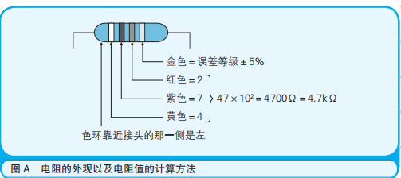

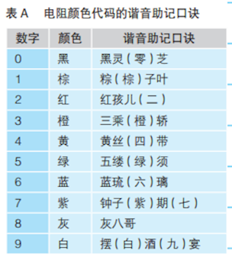

再补充一点，银色代表的误差等级是 ±10%，金色代表的误差等级是 ±5%。记忆时可以参考奥运会的奖牌，金牌比银牌的级别高，所以金色的误差更小。

## 第5章　与算法成为好朋友的七个要点
### 1.要点 1：算法中解决问题的步骤是明确且有限的
### 2.要点 5：使用编程技巧提升程序执行速度
### 3.要点 6：找出数字间的规律
所有的信息都可以用数字表示——这是计算机的特性之一。因此为了构造算法，经常会利用到存在于数字间的规律。

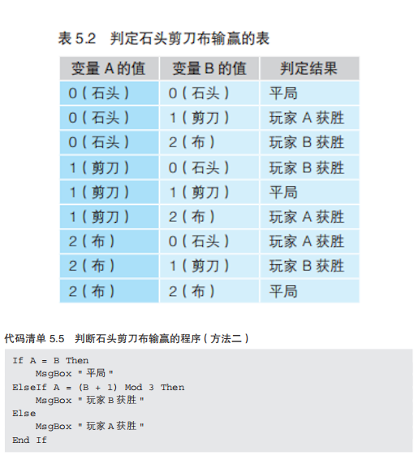

## 第6章　与数据结构成为好朋友的七个要点
### 1.程序中的变量是指什么？
变量是数据的容器。

变量中所存储的数据是可以改变的。变量的实质是按照变量所存储数据的大小被分配到的一块内存空间。

### 2.要点 2：了解作为数据结构基础的数组

## 第7章　成为会使用面向对象编程的程序员吧
### 1.对 OOP 的多种理解方法
将关注点置于对象（Object）本身，对象的构成要素包含对象的行为及操作

## 第8章　一用就会的数据库
### 1.键和索引的区别是什么？
键用于设定表和表之间的关系（Relationship），而索引是提升数据检索速度的机制。

## 第9章　通过七个简单的实验理解TCP/IP网络
### 1.协议
但为了交换信息，还必须在发送者和接收者之间事先确定发送方式。这种对信息发送方式的规定或约束就称为“协议”（Protocol）。

### 2.查看MAC地址
``` bash
$> cat /sys/class/net/wlp2s0/address
```
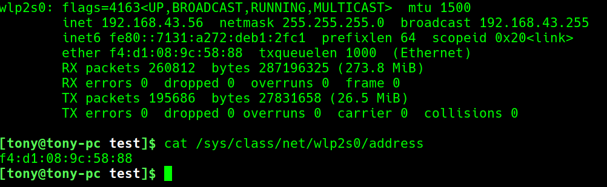

```bash
$> ip addr
```
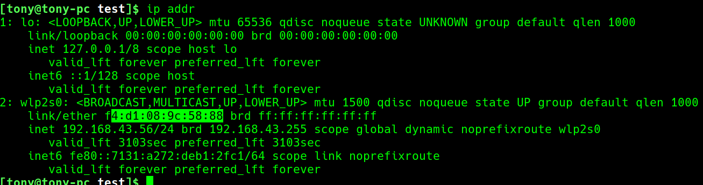

```bash
$> cat /proc/net/arp 
# 不能看到本机的MAC，只能看到远程连接，服务端用的比较多。
```
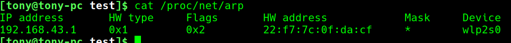


在网线上有没有其他的计算机正在传输电信号，也就是说要先确保没有人在占用网络，然后才能发送自己想传输的电信号。谁先抢到了网线的使用权，谁就先发送。万一遇到了多台计算机同时都想发送电信号的情况，只需要让这些计算机等待一段长度随机的时间后再重新发送相同的电信号即可。这套机制叫作  **CSMA/CD（Career Sense Multiple Access with Collision Detection，带冲突检测的载波监听多路访问）。**

所谓 **载波监听（Career Sense）**，指的是这套机制会去监听（Sense）表示网络是否正在使用的电信号（Career）。

而 **多路复用（Multiple Access）** 指的是多个（Multiple）设备可以同时访问（Access）传输介质。

**带冲突检测（with Collision Detection）** 则表示这套机制会去检测（Detection）因同一时刻的传输而导致的电信号冲突（Collision）。

### 3.实验2 ：查看计算机的IP地址
 TCP/IP 网络中，除了硬件上的 MAC 地址，还需要为每台计算机设定一个软件上的编号。这个编号就是众所周知的 IP 地址。

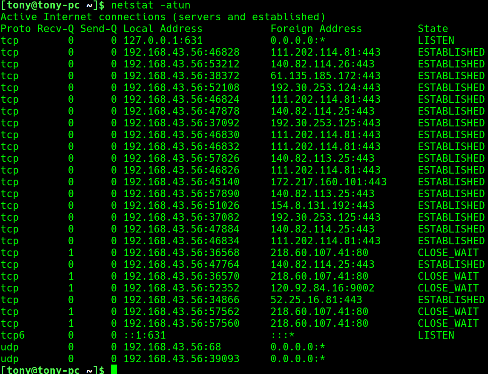
```
usage: netstat [-vWeenNcCF] [<Af>] -r         netstat {-V|--version|-h|--help}
       netstat [-vWnNcaeol] [<Socket> ...]
       netstat { [-vWeenNac] -i | [-cnNe] -M | -s [-6tuw] }

        -r, --route              display routing table
        -i, --interfaces         display interface table
        -g, --groups             display multicast group memberships
        -s, --statistics         display networking statistics (like SNMP)
        -M, --masquerade         display masqueraded connections

        -v, --verbose            be verbose
        -W, --wide               don't truncate IP addresses
        -n, --numeric            don't resolve names
        --numeric-hosts          don't resolve host names
        --numeric-ports          don't resolve port names
        --numeric-users          don't resolve user names
        -N, --symbolic           resolve hardware names
        -e, --extend             display other/more information
        -p, --programs           display PID/Program name for sockets
        -o, --timers             display timers
        -c, --continuous         continuous listing

        -l, --listening          display listening server sockets
        -a, --all                display all sockets (default: connected)
        -F, --fib                display Forwarding Information Base (default)
        -C, --cache              display routing cache instead of FIB

  <Socket>={-t|--tcp} {-u|--udp} {-U|--udplite} {-S|--sctp} {-w|--raw}
           {-x|--unix} --ax25 --ipx --netrom
  <AF>=Use '-6|-4' or '-A <af>' or '--<af>'; default: inet
  List of possible address families (which support routing):
    inet (DARPA Internet) inet6 (IPv6) ax25 (AMPR AX.25) 
    netrom (AMPR NET/ROM) ipx (Novell IPX) ddp (Appletalk DDP) 
    x25 (CCITT X.25) 

```
-a (all)显示所有选项，默认不显示LISTEN相关；
-t (tcp)仅显示tcp相关选项；
-u (udp)仅显示udp相关选项；

### 4.实验 4：路由器是数据传输过程中的指路人
互联网就是用路由器把多个LAN 连接起来所形成的一张大网。

因为路由器的工作原理就是查看附加到数据上的 IP 地址中的网络地址部分，只要发现这个数据不是发送给 LAN 内计算机的，就把它发送到 LAN 外，即互联网的世界中。

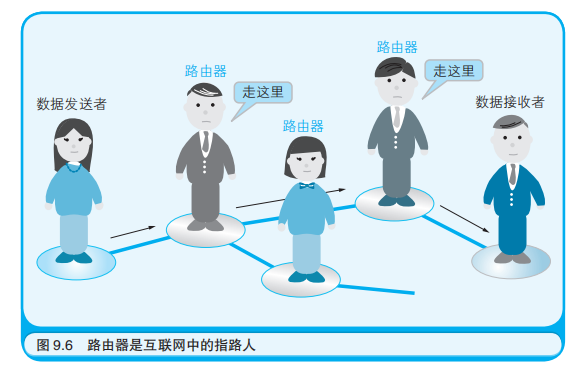

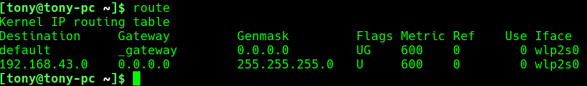

字段 | 说明
:-:|-
Destination|目标网络或目标主机。Destination 为 default（0.0.0.0）时，表示这个是默认网关，所有数据都发到这个网关。
Gateway|网关地址，0.0.0.0 表示当前记录对应的 Destination 跟本机在同一个网段，通信时不需要经过网关。如果没有就显示星号(*)。
Genmask|Destination 字段的网络掩码，Destination 是主机时需要设为 255.255.255.255，是默认路由时会设置为 0.0.0.0
Flags|标记<br>● U 该路由可以使用。<br>● H 该路由是到一个主机，也就是说，目的地址是一个完整的主机地址。如果没有设置该标志，说明该路由是到一个网络，而目的地址是一个网络地址：一个网络号，或者网络号与子网号的组合。<br>● G 该路由是到一个网关（路由器）。如果没有设置该标志，说明目的地 是直接相连的。<br>● R 恢复动态路由产生的表项。<br>● D 该路由是由改变路由（redirect）报文创建的。<br>● M 该路由已被改变路由报文修改。<br>● ! 这个路由将不会被接受。
Metric|路由距离，到达指定网络所需的中转数，是大型局域网和广域网设置所必需的。
Ref|路由项引用次数 。
Use|此路由项被路由软件查找的次数。
Iface|网卡名字，例如 eth0。

### 5.查看路由的过程
```
$> pacman -S traceroute
$> traceroute www.baidu.com
```
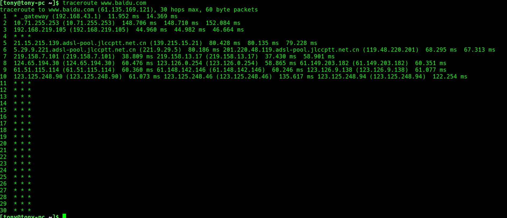

### 6.查看 IP 地址和 MAC 地址的对应关系
计算机中就加入了一种程序，用于实现由 IP 地址到 MAC 地址的转换，这种功能被称作 **ARP（Address Resolution Protocol，地址解析协议）**。

ARP 的工作方式很有意思。它会对 LAN 中的所有计算机提问：“有谁的 IP 地址是 210.160.205.80 吗？有的话请把你的 MAC 地址告诉我。”


如果为了查询 MAC 地址，每回都要进行广播询问，那么查询的效率就会降低。于是 ARP 还提供了缓存的功能，当向各个计算机都询问完一轮之后，就会把得到的 MAC 地址和 IP 地址的对应关系缓存起来（临时保存在内存中）。存起来的这些对应关系信息称作 **“ARP 缓存表”**。


### 7.TCP 的作用及 TCP/IP 网络的层级模型
**IP 协议**用于指定数据发送目的地的 IP 地址以及通过路由器转发数据。

**TCP 协议**则用于通过数据发送者和接收者相互回应对方发来的确认信号，可靠地传输数据

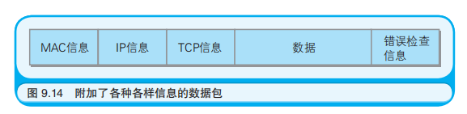

硬件上发送数据的是网卡。在网卡之上是设备驱动程序（用于控制网卡这类硬件的程序），设备驱动程序之上是实现了 IP 协议的程序，IP程序之上则是实现了 TCP 协议的程序，而再往上才是应用程序，比如Web 或电子邮件。

## 第10章　试着加密数据吧
### 1.在数字签名中使用的信息摘要是什么？
信息摘要是指从作为数字签名对象的文件整体中计算出的数值。

### 2.字符编码
文本数据可以由各种各样的字符构成。其中每个字符都被分配了一个数字，我们称之为“字符编码”。

### 3.数字签名可以证明数据的发送者是谁
在中国有盖章的习惯，而在欧美则是签字。印章和签名都可以证明一个事实，那就是某个人承认了文件的内容是完整有效的。而在通过网络传输的文件中，数字签名可以发挥出与印章和签名同样的证明效果。

## 第11章　XML究竟是什么
### 1.XML 是什么的缩写？
XML 是 Extensible Markup Language（可扩展标记语言）的缩写。

### 2.HTML 和 XML 的区别是什么？
HTML 是用于编写网页的标记语言。XML 是用于定义任意标记语言的元语言。

### 3.在处理 XML 文档的程序组件中，哪个成为了 W3C 的推荐标准？
DOM（Document Object Model，文档对象模型）。

### 4.XML可扩展与HTML不可扩展
XML 本身并不会限定标签的种类，反倒是允许 XML 的使用者随心所欲地创建标签。也就是说，在“<”和“>”中的单词可以是任意的。这就是所谓的 **“可扩展”**。

在 HTML 中，我们只能使用由 HTML 定义出的那若干种标签，因此 HTML 是**固定**的标记语言。

也就是说通过定义要使用的标签种类，就可以创造出一门新的标记语言。通常把这种用于创造语言的语言称作 **“元语言”**。

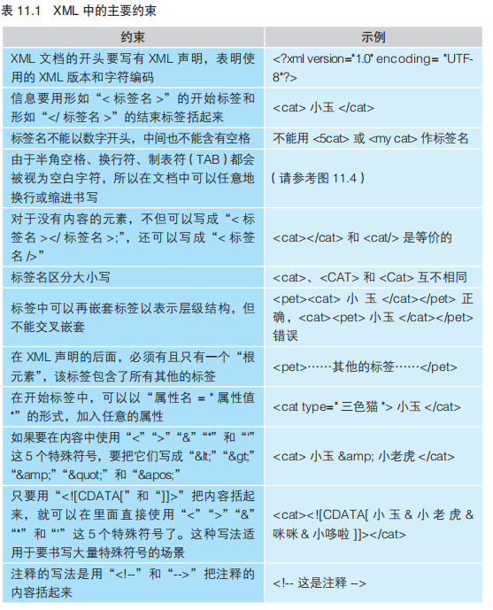

### 5.CSV（Comma Separated Value，逗号分隔值）
与 XML 一样，CSV 也是仅由字符构成的纯文本文件。一般情况下，CSV 文件的扩展名为 .csv。

## 第12章　SE负责监管计算机系统的构建
### 1.请列举一个软件开发过程的模型。
软 件 开 发 过 程 的 模 型 有“瀑 布 模 型 ”“原 型 模型”“螺旋模型”等。

### 2.SE 是什么的缩略语？
SE 是 System Engineer（系统工程师）的缩略语。

SE 需要具备从硬件结构、软件的构建方法乃至横跨整个业务的广泛知识以及项目管理的经验。

SE 负责的工作是项目管理和软件开发管理，以及引进计算机系统后的维护，而制作软件（编程）的工作则交由程序员完成。

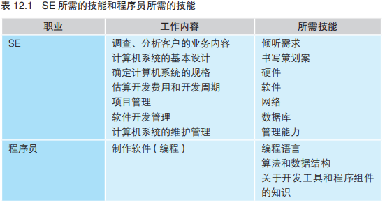

### 3.系统开发过程的规范
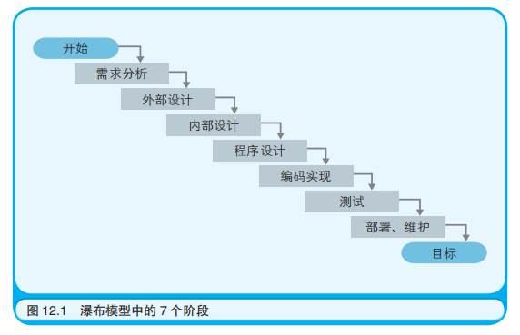

### 4.所谓设计，就是拆解
从需求分析到程序设计，所进行的工作都是拆解业务，把将要为计算机系统所替代的手工业务拆解为细小的要素。


